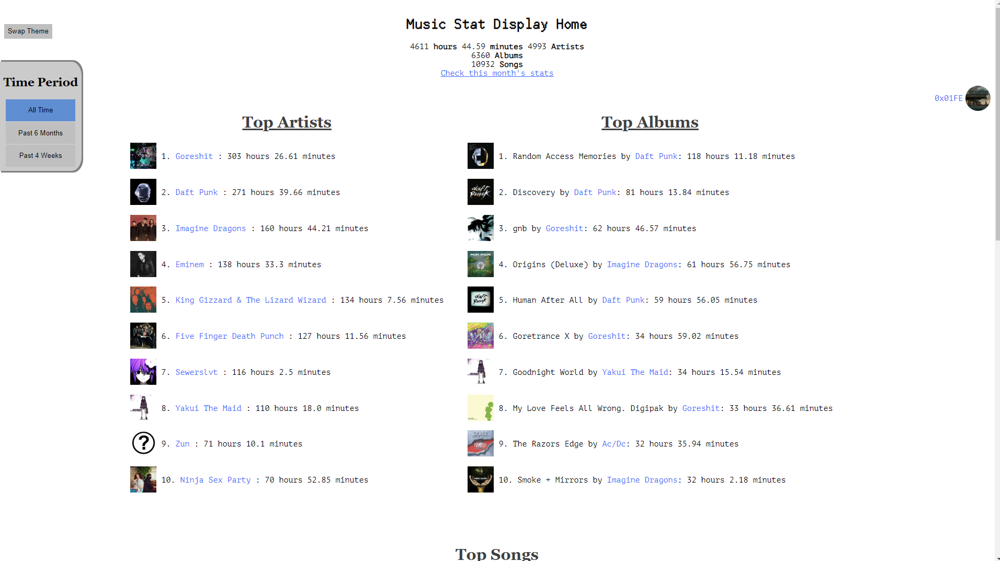
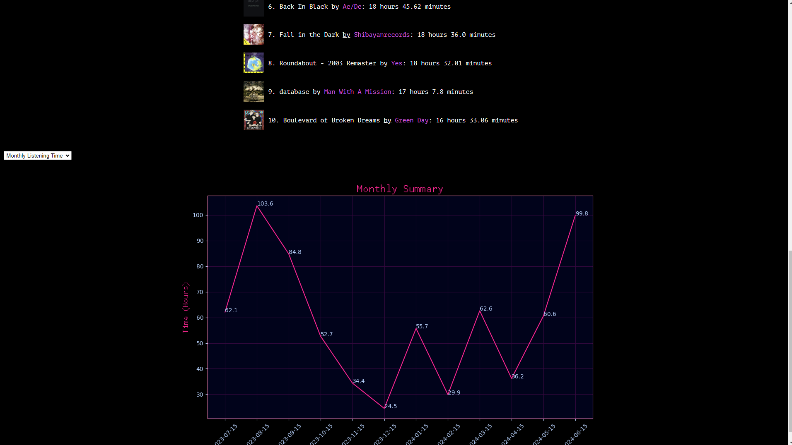
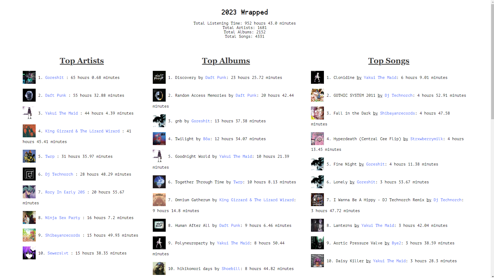

# About

This is a front end web display for [this](https://github.com/0x01FE/spotify-artist-time-tracking) other project of mine.

These two projects work together to track and display Spotify listening data. The project uses Flask and Jinja2 templates to serve pages. These pages are just meant to be a nice user interface for the database storing user information. User information can be marked for private or public viewing.



The current version of the site has two themes. A light and dark mode. The website has various time periods of data to display to the user and some graphs it will generate for data visualization.



The website also contains a wrapped for users to look at during any point of the year. The wrapped results will differ slightly from Spotify's wrapped as getting 100% accurate data is difficult, and I'm not quite sure how Spotify computes a user's top artists (it's some combination of time and plays).



# Config File Format
This program uses a config.ini file for some basic variables. This is an example of how I have mine set up.

```ini
[PATHES]
templates=app/templates/
database=data/spotify-listening-data.db
SQL=app/sql/

[NETWORK]
port=5000

[SPOTIFY]
client_id = SPOTIFY_API_CLIENT_ID
client_secret = SPOTIFY API_CLIENT_SECRET
redirect_uri = SPOTIFY_API_REDIRECT_URI
scopes = SPOTIFY_API_SCOPES

[FLASK]
secret=some hash value for flask_session
```

If you are connecting this program to the [Spotify Time Tracking Project](https://github.com/0x01FE/spotify-artist-time-tracking) the database path should point to a volume mount that is the same volume mount that the Spotify Time Tracking container uses.

# Setup

This program was designed to be used with Docker containers.

## Docker


Run this docker command to build the image.

```sh
docker build . -t music-stat-display:v3
```

After that configure the example docker compose file in the repo and run,
```sh
docker compose up
```
Add the -d flag if you want it to run in the background.


# Required Environment Variables
env=DEV or PROD

